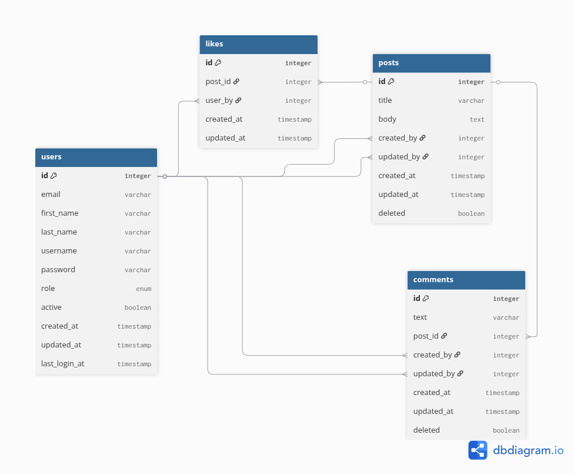

# Database Design

## The DB model diagram can be seen at [model](https://dbdiagram.io/d/68d34b6e7c85fb99610c7616)



---

## 📘 Overview

This database schema is designed for a **simple blogging or content-sharing platform** with support for:

* User accounts (admin & regular users)
* Creating posts
* Commenting on posts
* Liking posts
* Soft-deletion for safety
* Timestamps for auditability

The goal is to provide a **relational structure** that is:

* Easy to understand
* Easy to extend
* Safe for collaborative environments
* Enforces data integrity via foreign keys

---

## 🧱 Tables & Relationships

### 1. `users`

This table stores **all users** in the system, including admins and regular users.

**Fields:**

* `id`: Primary key (BIGINT, scalable)
* `email`, `username`: Unique identifiers
* `role`: Either `'user'` or `'admin'`
* `password`: Stored as a secure hash (e.g., bcrypt)
* `active`: Used to disable accounts without deleting
* `created_at`, `updated_at`, `last_login_at`: Useful for audits and UX features

> 🔐 Best practice: Never store plaintext passwords — always hash them.

---

### 2. `posts`

Represents content created by users (e.g., blog posts or messages).

**Fields:**

* `id`, `title`, `body`: Basic post data
* `created_by`, `updated_by`: Links to users
* `created_at`, `updated_at`: For sorting or versioning
* `deleted_at`: Enables **soft deletion** (not removed from DB, just hidden)

> 📝 Posts are always linked to a valid user. If a user is deleted, their posts are deleted too (`ON DELETE CASCADE`).

---

### 3. `comments`

Stores **user comments on posts**.

**Fields:**

* `text`: The comment itself
* `post_id`: References the post it's attached to
* `created_by`, `updated_by`: References users
* `deleted_at`: Supports soft deletion

> 💬 Each comment belongs to one post and one user. Comments are deleted automatically if the associated post is deleted.

---

### 4. `likes`

Tracks **likes (or "hearts")** that users give to posts.

**Fields:**

* `post_id`: The liked post
* `user_by`: The user who liked it
* `deleted_at`: In case a like is undone (soft delete)

> ❤️ A user can only like a post **once** — enforced by a unique constraint on `(post_id, user_by)`.

---

## 🛡️ Data Integrity

* All relationships use **foreign keys** to ensure data consistency.
* If a user is deleted, their posts, comments, and likes are also deleted automatically (via `ON DELETE CASCADE`).
* `updated_by` is set to `NULL` if the updater is deleted (`ON DELETE SET NULL`).
* **Soft deletes** via `deleted_at` allow for undoing deletions and better audit logging.

---

## 📈 Why Use BIGINT for IDs?

* `BIGINT` allows ID values up to \~9 quintillion — so your app won't break even with billions of records.
* It’s a small performance tradeoff for long-term scalability.

---

## 🕓 Why Use `deleted_at` Instead of `deleted BOOLEAN`?

* `deleted_at` provides more context — you can see **when** the deletion occurred.
* You can easily filter active records with:

  ```sql
  WHERE deleted_at IS NULL
  ```
* Easier to build features like **undelete**, **recycle bin**, or **audit logs**.

---

## 🚀 Extensibility Ideas

This schema is modular and can be extended with:

* **Categories or tags** for posts
* **User profiles** (bio, avatar, social links)
* **Post versioning or edit history**
* **Moderation logs**
* **Notifications system**

---

## ✅ Summary of Key Features

| Feature              | Description                              |
| -------------------- | ---------------------------------------- |
| User accounts        | With roles, status, timestamps           |
| Posts & comments     | Rich content support                     |
| Likes                | Unique likes per post/user               |
| Soft deletion        | Safer than permanent deletes             |
| Audit timestamps     | `created_at`, `updated_at`, `deleted_at` |
| Relational integrity | Enforced with foreign keys               |
| Scalable IDs         | All `id` fields use `BIGINT`             |

---
